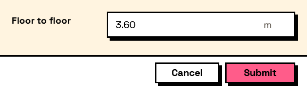

## In Depth

`Rule.Range(minimum: null, maximum: null, message: "")`

The field's number must fall between the bounds. Either bound can be left out for a one-sided range.

Both ends are inclusive: a range of 1 to 10 accepts 1 and accepts 10.

Worth knowing when this is the right tool. `Input.Number`'s own minimum and maximum stop an out-of-range value being *typed*, which is a better experience where it applies. This is for the cases that cannot: a bound that depends on another field, or a number arriving in a text box.

The inputs are:

- `minimum` (_object_, defaults to `null`) — Lowest acceptable value.
- `maximum` (_object_, defaults to `null`) — Highest acceptable value.
- `message` (_string_, defaults to `""`) — Wording shown when it does not.

Returns `rule` — The rule.

Search terms: `range`, `between`, `minimum`, `maximum`, `bounds`, `limit`.

___
## About the Rule nodes

Checks applied to a field's answer, for use with `Behavior.WithValidation`.

Rules run as the user types and block submission while any of them fails. A rule on a field the user cannot see is never applied — a hidden field can never stop a form being submitted, which would otherwise mean an error with no control to fix it.

Except for `Rule.Required`, every rule passes on an empty field. Emptiness is `Behavior.Required`'s business, so an optional field with a range on it stays optional.

___
## Example File

An example graph ships beside this page as `Interlude.Rule.Range.dyn`.

The form it builds:

