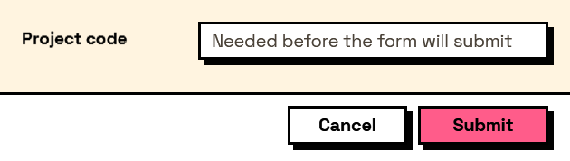

## In Depth

`Rule.Required(message: "")`

The field must have an answer.

The exception to the family rule: every other rule passes on an empty field and this one is the reason they can, because emptiness is dealt with here rather than in each of them.

`Behavior.Required` does the same job in one node and adds the asterisk beside the label, which is what a user actually reads. Reach for this one when the requirement needs wording of its own, or when it is going into a list of rules alongside others.

The inputs are:

- `message` (_string_, defaults to `""`) — Wording shown when it does not.

Returns `rule` — The rule.

Search terms: `required`, `mandatory`, `not empty`, `must`.

___
## About the Rule nodes

Checks applied to a field's answer, for use with `Behavior.WithValidation`.

Rules run as the user types and block submission while any of them fails. A rule on a field the user cannot see is never applied — a hidden field can never stop a form being submitted, which would otherwise mean an error with no control to fix it.

Except for `Rule.Required`, every rule passes on an empty field. Emptiness is `Behavior.Required`'s business, so an optional field with a range on it stays optional.

___
## Example File

An example graph ships beside this page as `Interlude.Rule.Required.dyn`.

The form it builds:

