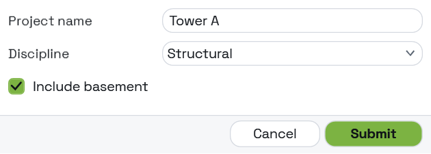

## In Depth

`Theme.Create(mode: "Auto", accent: "", density: "Comfortable", cornerRadius: 4, fontSize: 13, fontFamily: "", labelWidth: 130, reducedMotion: false, shape: "Rounded", uppercaseHeaders: false, headerTracking: 0, borderWidth: 1, shadowOffset: 0, heavyText: false)`

A theme built from scratch, with every knob exposed.

The presets are combinations of these ports; when one of them is nearly right, this is how you get the rest of the way. Note that it starts from the *conventional* look — hairline outlines, rounded corners, no shadows — not from the neubrutalist default, so a theme built here is quiet unless you ask for otherwise.

The ports worth understanding:

`shape` is Rounded, Pill or Square, and **Pill ignores `cornerRadius`** — it derives the radius from the control height instead, because "fully rounded" depends on how tall a control is. `borderWidth` and `shadowOffset` are what the neubrutalist look is built from; the shadow is solid and unblurred, and zero switches it off. `labelWidth: 0` stacks labels above their fields, which is the better shape for a narrow form or long captions. `uppercaseHeaders` and `headerTracking` apply to headings only, never to body text, where letter spacing costs more in readability than it returns.

Leave `fontFamily` empty to keep Interlude's own embedded font, which renders the same on every machine. A font named here but not installed falls back to whatever the host has.

The inputs are:

- `mode` (_string_, defaults to `"Auto"`) — Auto, Light or Dark. Auto follows the Windows setting.
- `accent` (_string_, defaults to `""`) — Accent colour as hex. Empty keeps the palette's own accent.
- `density` (_string_, defaults to `"Comfortable"`) — Compact, Comfortable or Spacious.
- `cornerRadius` (_number_, defaults to `4`) — How rounded controls are, in pixels.
- `fontSize` (_number_, defaults to `13`) — Base text size, in pixels.
- `fontFamily` (_string_, defaults to `""`) — Font name. Empty uses the host's interface font.
- `labelWidth` (_number_, defaults to `130`) — Width of the label column. Zero stacks labels above their fields.
- `reducedMotion` (_boolean_, defaults to `false`) — Switch off transitions.
- `shape` (_string_, defaults to `"Rounded"`) — Rounded, Pill or Square. Pill ignores cornerRadius and uses the control height.
- `uppercaseHeaders` (_boolean_, defaults to `false`) — Render section and card headings as capitals.
- `headerTracking` (_number_, defaults to `0`) — Space between the letters of a heading, as a fraction of the font size.
- `borderWidth` (_number_, defaults to `1`) — How thick control outlines are, in pixels.
- `shadowOffset` (_number_, defaults to `0`) — How far a solid, unblurred shadow sits below and right of each control, in pixels. Zero is no shadow.
- `heavyText` (_boolean_, defaults to `false`) — Set labels, headings and buttons in a heavier weight.

Returns `theme` — The theme.

Search terms: `theme`, `custom`, `style`, `brand`, `accent`, `font`, `density`, `pill`, `shape`, `border`, `shadow`.

___
## About the Theme nodes

How a form looks. Feed the result into `Form.Show`'s theme port.

A theme is applied to the form's own window and nowhere else. Interlude runs inside Revit and inside Dynamo, and restyling a host application from a package would be an unwelcome surprise no matter how good the styling was.

___
## Example File

An example graph ships beside this page as `Interlude.Theme.Create.dyn`.

The form it builds:

