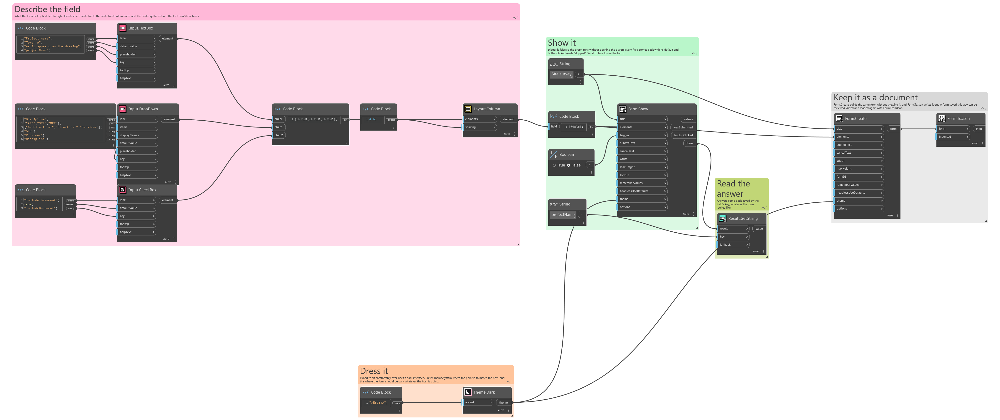
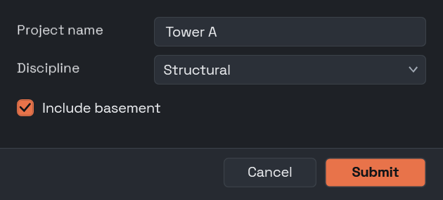

## In Depth

`Theme.Dark(accent: "")`

A dark theme, tuned to sit comfortably over Revit's dark interface. Conventional, like `Theme.Light`: nothing here is loud.

The inputs are:

- `accent` (_string_, defaults to `""`) — Accent colour as hex, such as "#4C8DFF". Empty keeps the default.

Returns `theme` — The theme.

Search terms: `theme`, `dark`, `night`, `revit`.

___
## About the Theme nodes

How a form looks. Feed the result into `Form.Show`'s theme port.

A theme is applied to the form's own window and nowhere else. Interlude runs inside Revit and inside Dynamo, and restyling a host application from a package would be an unwelcome surprise no matter how good the styling was.

___
## Example File

An example graph ships beside this page as `Interlude.Theme.Dark.dyn`.

The form it builds:

