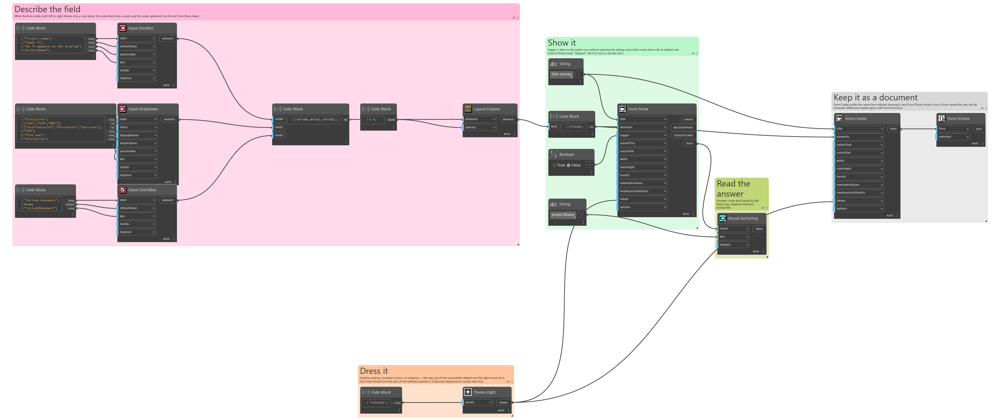
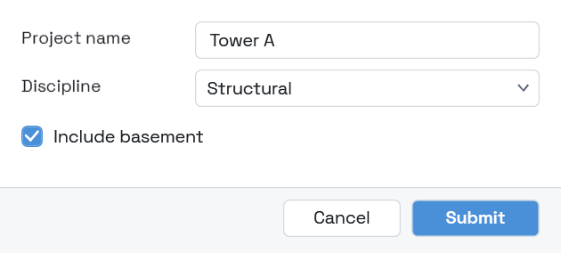

## In Depth

`Theme.Light(accent: "")`

A light theme — the conventional one: hairline outlines, rounded corners, no shadows.

The way out of the neubrutalist default, and the right choice for a form that should look like part of the software around it rather than like a thing of its own. Corporate deployments usually want this.

Give an `accent` to brand it. The text drawn on that accent is chosen automatically by contrast, so a bright colour still reads.

The inputs are:

- `accent` (_string_, defaults to `""`) — Accent colour as hex, such as "#2F6FEB". Empty keeps the default.

Returns `theme` — The theme.

Search terms: `theme`, `light`, `bright`, `day`.

___
## About the Theme nodes

How a form looks. Feed the result into `Form.Show`'s theme port.

A theme is applied to the form's own window and nowhere else. Interlude runs inside Revit and inside Dynamo, and restyling a host application from a package would be an unwelcome surprise no matter how good the styling was.

___
## Example File

An example graph ships beside this page as `Interlude.Theme.Light.dyn`.

The form it builds:

