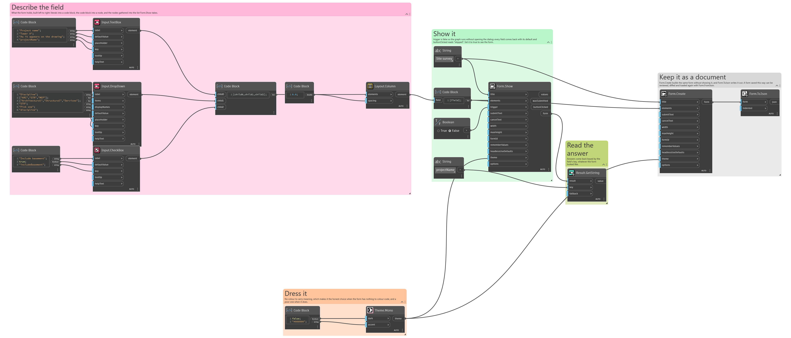
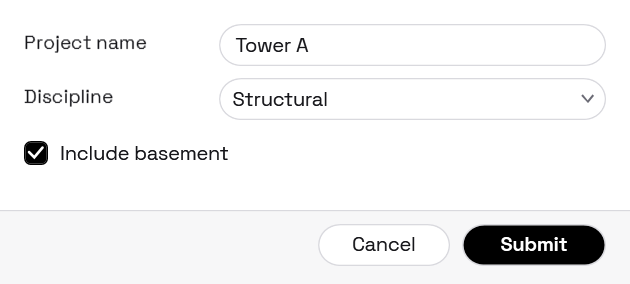

## In Depth

`Theme.Mono(dark: false, accent: "")`

A monochrome theme: black, white and grey, pill-shaped controls, and small spaced capitals for section headings.

Removing colour forces the layout to carry the design, which is why this style reads as deliberate rather than unfinished. Errors keep a red, though — an error nobody can pick out from ordinary text is a usability bug, and no amount of restraint is worth that.

The inputs are:

- `dark` (_boolean_, defaults to `false`) — Ink on paper, or paper on ink.
- `accent` (_string_, defaults to `""`) — Overrides the ink used for buttons and selection, as hex. Empty keeps it monochrome.

Returns `theme` — The theme.

Search terms: `mono`, `monochrome`, `black`, `white`, `minimal`, `swiss`, `pill`.

___
## About the Theme nodes

How a form looks. Feed the result into `Form.Show`'s theme port.

A theme is applied to the form's own window and nowhere else. Interlude runs inside Revit and inside Dynamo, and restyling a host application from a package would be an unwelcome surprise no matter how good the styling was.

___
## Example File

An example graph ships beside this page as `Interlude.Theme.Mono.dyn`.

The form it builds:

