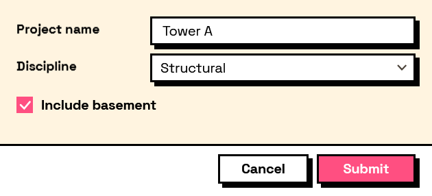

## In Depth

`Theme.Neubrutalism(dark: false, accent: "")`

Neubrutalism: heavy black outlines, square corners, solid unblurred shadows offset down and to the right, loud flat colour, and type set hard. This is what a form looks like when nobody supplies a theme.

The style is deliberately undesigned-looking — it borrows from brutalist architecture the idea that structure should be visible rather than smoothed over. Every edge is drawn, every control sits on its own shadow, and buttons drop onto that shadow when pressed. There is no gradient, no blur and no soft grey anywhere in it.

The inputs are:

- `dark` (_boolean_, defaults to `false`) — Ink on paper, or the whole thing inverted.
- `accent` (_string_, defaults to `""`) — Overrides the loud colour used for buttons and selection, as hex. Empty keeps the preset's own — hot pink in light, acid lime in dark.

Returns `theme` — The theme.

Search terms: `neubrutalism`, `neubrutalist`, `brutal`, `brutalist`, `neo`, `bold`, `loud`, `fun`, `memphis`, `shadow`.

___
## About the Theme nodes

How a form looks. Feed the result into `Form.Show`'s theme port.

A theme is applied to the form's own window and nowhere else. Interlude runs inside Revit and inside Dynamo, and restyling a host application from a package would be an unwelcome surprise no matter how good the styling was.

___
## Example File

An example graph ships beside this page as `Interlude.Theme.Neubrutalism.dyn`.

The form it builds:

