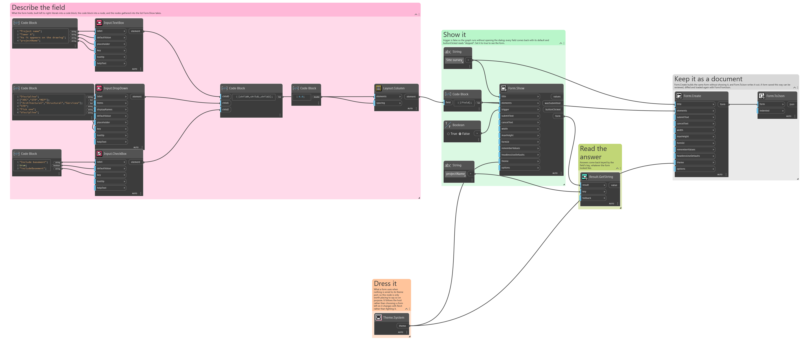
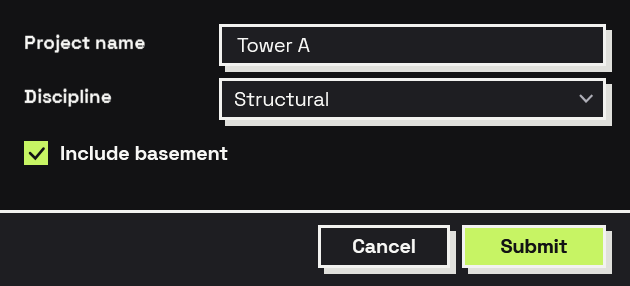

## In Depth

`Theme.System()`

The default look, but following the Windows light or dark setting instead of staying light.

A form with nothing on its theme port is light, because the default palette is designed around cream and black and the inverted one is a different design rather than the same one dimmed. This node is for a graph that would rather match whatever the machine is set to.

Returns `theme` — The theme.

Search terms: `theme`, `default`, `system`, `auto`, `follow`, `windows`.

___
## About the Theme nodes

How a form looks. Feed the result into `Form.Show`'s theme port.

A theme is applied to the form's own window and nowhere else. Interlude runs inside Revit and inside Dynamo, and restyling a host application from a package would be an unwelcome surprise no matter how good the styling was.

___
## Example File

An example graph ships beside this page as `Interlude.Theme.System.dyn`.

The form it builds:

