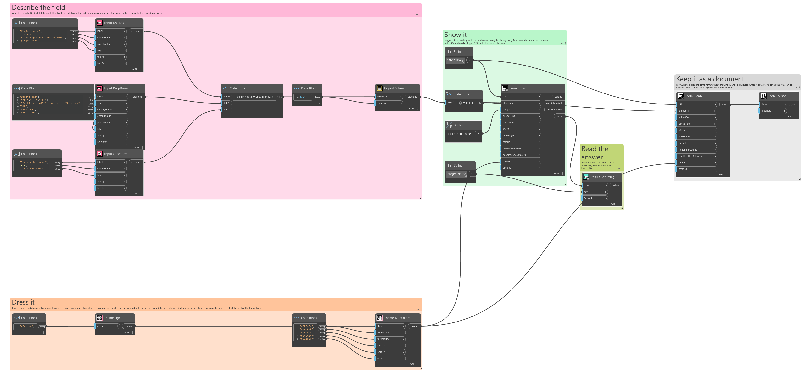
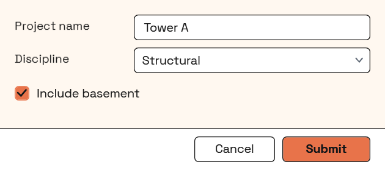

## In Depth

`Theme.WithColors(theme, background: "", foreground: "", surface: "", border: "", error: "")`

Replaces individual colours in a theme's palette. Every colour left empty keeps the value it already had.

The inputs are:

- `theme` (_ThemeDefinition_) — The theme to adjust.
- `background` (_string_, defaults to `""`) — Window backdrop, as hex.
- `foreground` (_string_, defaults to `""`) — Main text colour, as hex.
- `surface` (_string_, defaults to `""`) — Panels and cards, as hex.
- `border` (_string_, defaults to `""`) — Control outlines, as hex.
- `error` (_string_, defaults to `""`) — Validation colour, as hex.

Returns `theme` — The adjusted theme.

Search terms: `theme`, `palette`, `colors`, `colours`, `brand`, `override`.

___
## About the Theme nodes

How a form looks. Feed the result into `Form.Show`'s theme port.

A theme is applied to the form's own window and nowhere else. Interlude runs inside Revit and inside Dynamo, and restyling a host application from a package would be an unwelcome surprise no matter how good the styling was.

___
## Example File

An example graph ships beside this page as `Interlude.Theme.WithColors.dyn`.

The form it builds:

